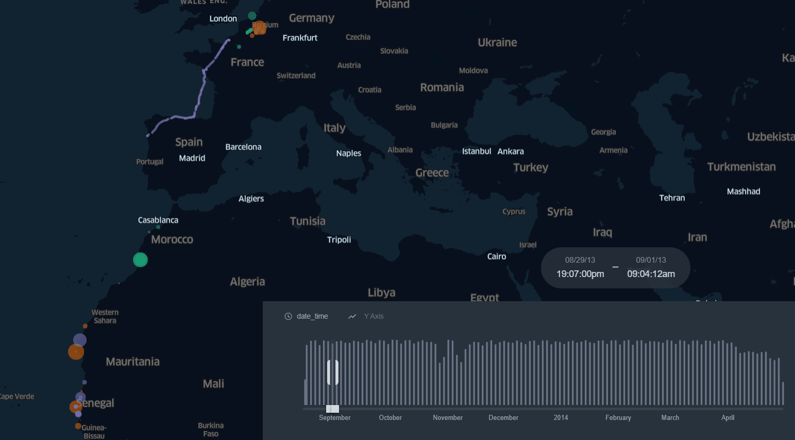

## Stop detection in GPS tracks - Movingpandas & KeplerGl - point map with stop's duration in Bird migration tracking

## [Tutorial on Towards Data Science](https://towardsdatascience.com/stop-detection-in-gps-tracks-movingpandas-keplergl-point-map-with-stops-duration-in-bird-664064b3ccbc)

## [Web map Demo](https://bryanvallejo16.github.io/stop-detection-bird-tracking/)

